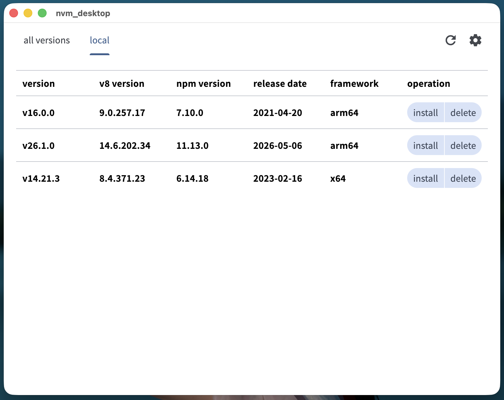

# **nvm_desktop**

A professional, cross-platform Node.js version manager built with Flutter. Designed for developers who need a seamless, GUI-driven experience to manage multiple Node.js environments on Windows and macOS.

[简体中文](./README_CN.md)

## **PerView**

## **Key Features**

- **Cross-Platform Support:** Full compatibility with Windows (x64) and macOS (ARM64、X86).
- **Architecture Aware:**
  - **macOS:** Native support for both Apple Silicon (ARM64) and Intel X86.
  - **Windows:** Robust support for x64 Node.js distributions.
- **Flutter Powered:** Built using the latest Flutter stable channel for a smooth, high-performance user interface.
- **System Integration:** Effortless management of environment variables and symbolic links without manual configuration.

## **Technical Specifications**

| Component              | Specification                    |
| :--------------------- | :------------------------------- |
| Framework              | Flutter (Channel stable, 3.41.9) |
| Supported Systems      | Windows 10+, macOS 11+           |
| Architecture (macOS)   | ARM64、X86                       |
| Architecture (Windows) | x64                              |

## **Build Instructions**

### **Prerequisites**

- **Flutter SDK:** 3.41.9
- **macOS:** brew install create-dmg
- **Windows:** Inno Setup installed and added to PATH.

### **macOS Packaging**

`# 1. Build release`  
`flutter build macos --release --dart-define=FLUTTER_XCODE_ARCHS=x86_64`  
`flutter build macos --release --dart-define=FLUTTER_XCODE_ARCHS=arm64`

`# 2. Strip extended attributes`  
`xattr -cr build/macos/Build/Products/Release/nvm_desktop.app`

`# 3. Ensure executable permissions`  
`chmod -R +x build/macos/Build/Products/Release/nvm_desktop.app`

`# 4. Generate DMG`  
`./build_dmg.sh arm64`  
`./build_dmg.sh x64`

### **Windows Packaging**

`# 1. Build release`  
`flutter build windows --release`

`# 2. Compile installer`  
`ISCC.exe build_exe.iss`
